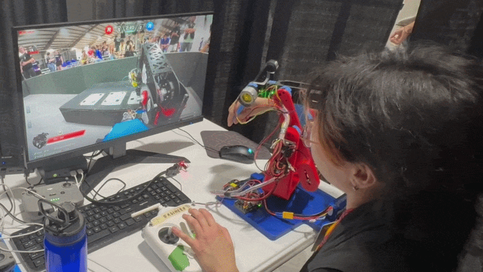

# ASN-Engineer-Custom-Controller
Open-sourced 2025 SFU Ascension Robotics Engineer Custom Controller code and CAD

- Self-Stabilizing 6 DOF leader arm used to control a PUMA style articulated robot arm
- Runs on a [Robomaster STM32 Type C Development board](https://www.robomaster.com/en-US/products/components/general/development-board-type-c/info)

Motors:
| Motors | Quantity |
| :--- | :--- |
| ROBOMASTER GM6020 | 1 |
| LingKong MS4005 V3 | 5 |

  
Pictured above: Engineer Custom Controller in use at ARC 2026, Purdue  
Robot driver: Katy Liu
